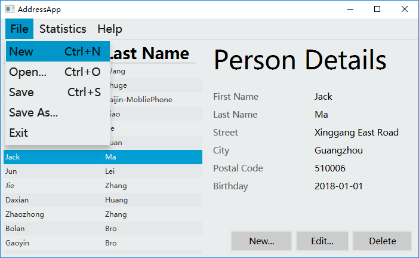
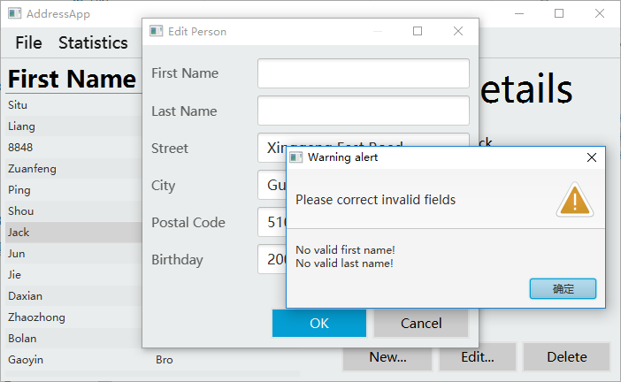
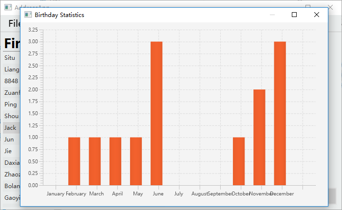

## 信息

姓名：席睿

学号：16340247

设计名称：花名册

## Address 使用说明

- 打开 Address.exe / Address.jar 或者 run Address project

- 出现程序主界面。左侧为人员列表，右侧为详情。

- 选中右侧人名，左侧详情即刻发生变化。

- 下方三个按钮分别为增加人员，修改人员和删除人员。

- 点击新增/更改人员，弹出一个文本输入框供用户输入信息。输入会检查合法性。

- 点击删除人员，删除当前选中人员。如果没有选中任何人，删除时会弹窗警告。

- 右上角【文件】可以选择新建花名册，将花名册保存/另存为，或者打开花名册。

- 右上角【统计】可以对表中人员的生日进行统计。

