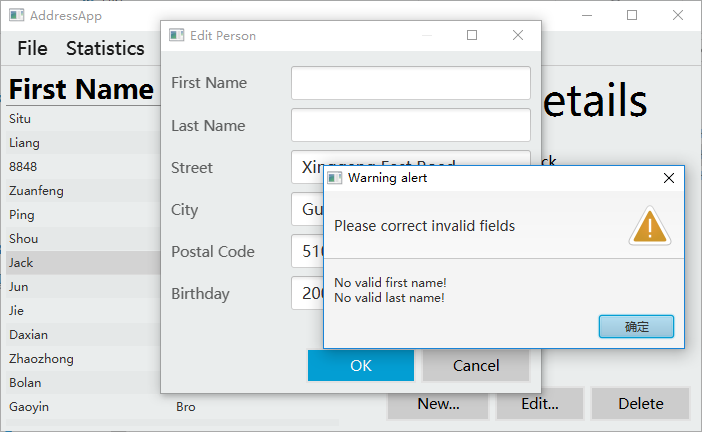
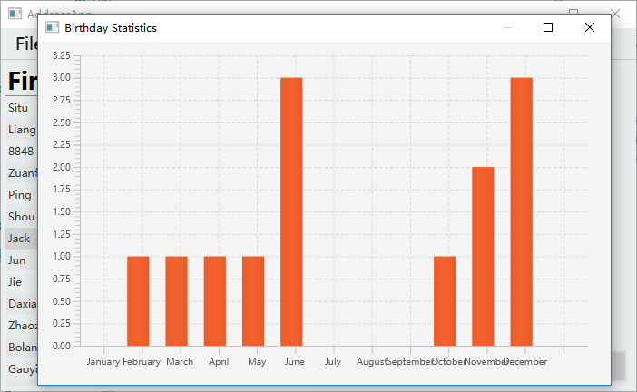
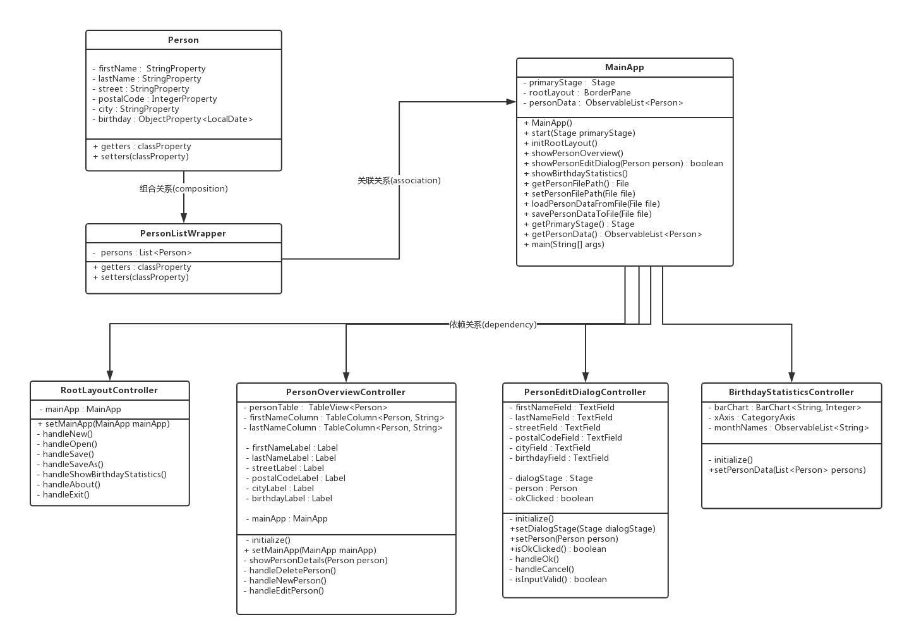
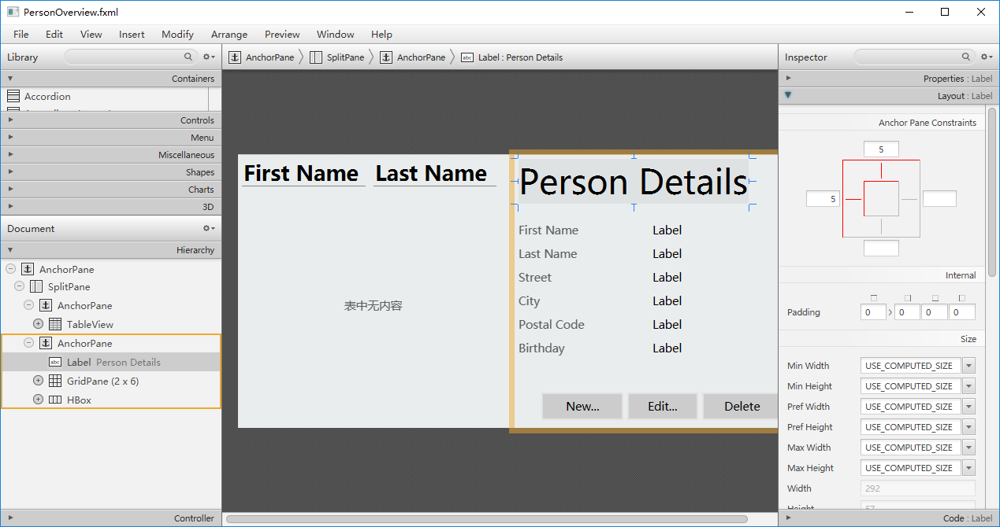
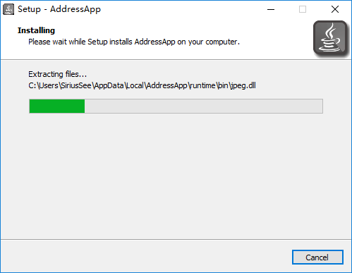

# Java 课程设计-花名册-项目报告

<!-- TOC -->

- [Java 课程设计-花名册-项目报告](#java-课程设计-花名册-项目报告)
    - [信息](#信息)
    - [开发环境](#开发环境)
    - [项目介绍](#项目介绍)
    - [功能说明](#功能说明)
        - [查看人员功能](#查看人员功能)
        - [修改人员功能](#修改人员功能)
        - [文件操作功能](#文件操作功能)
        - [统计功能](#统计功能)
        - [preferance 功能](#preferance-功能)
    - [UML 图](#uml-图)
    - [程序设计知识点说明](#程序设计知识点说明)
    - [功能实现说明](#功能实现说明)
        - [实时刷新的“详情”页面](#实时刷新的详情页面)
        - [对人员名单的修改](#对人员名单的修改)
        - [文件操作功能](#文件操作功能-1)
        - [生日统计功能](#生日统计功能)
        - [perferance 功能](#perferance-功能)
    - [技术难点说明](#技术难点说明)
        - [GUI 的设计与实现](#gui-的设计与实现)
        - [MVC 设计模式的实现](#mvc-设计模式的实现)
        - [打包与部署](#打包与部署)
    - [未解决的技术难点和讨论](#未解决的技术难点和讨论)
        - [多名单系统](#多名单系统)
        - [账户与云存储功能](#账户与云存储功能)
    - [一些感想](#一些感想)
    - [参考网站](#参考网站)

<!-- /TOC -->

## 信息

- 姓名 - 席睿
- 学号 - 16340247
- 班级 - 软件工程教务三班

## 开发环境

- IDE - Ecilpse Oxygen.2 Release (4.7.2)
- JDK - Java SE 8u151
- GUI - JavaFX Scene Builder
- Deploy - InnoSetup 5

## 项目介绍

这是一个简单的花名册系统。

用户可以使用此系统登记 姓名、住址、邮编和生日，并且保存在 `.xml` 文件中。

使用此系统，用户可以增加、删除和修改对应的人物信息，并且对于系统中的人物的生日进行统计。

因为对项目进行了打包，所以不需要在 JDK 环境下亦可运行此程序。

## 功能说明

### 查看人员功能

点击左边栏的人员，右边栏会显示他的姓名、住址、邮编和生日。

### 修改人员功能

- 增加人员

单击左下角的 **New** 按钮，弹出要求填写 **姓名、住址、邮编和生日** 的文本输入框。单击 **OK** ，系统会对输入的合法性进行检查。譬如，某些输入为空，或者生日日期不符合格式时，单击 **OK** 会收到错误提示。单击**确认**可以离开错误提示，重新更改输入。单击 **Cancel** 退出 **增加人员**。

- 修改人员

单击左下角的 **Edit** 按钮修改人员。与增加人员同理，需要填写相应的文本框。此时文本框中内容不是预设内容，而是原有内容。

如果未选中任何一个人物就单击 **Edit** ,会弹出 **请选择一个对象** 的提示框。



- 删除人员

选中一个人员，单击 **Delete** 删除之。如果此时表中人员为空，则会弹出 **请选择一个对象** 的提示框。

### 文件操作功能

- 新建文件

点击左上角 **File**，选择 **New** 新建一个文件。或者按 `Ctrl+N` 新建亦可。

- 打开文件

点击左上角 **File**，选择 **Open** 打开一个文件。或者按 `Ctrl+O` 亦可。此时会弹出文件浏览器，你需要选择一个 `.xml` 文件打开。

- 文件保存/另存为

点击左上角 **File**，选择 **Save/Save as** 或者按 `Ctrl+S` 保存为一个 `.xml` 文件。第一次保存/另存为时，会弹出文件浏览器。你需要输入文件名并且选择一个保存路径。

### 统计功能

- 统计生日

左上角 **Stat** 可以统计当前页面用户的生日，并生成月份的柱状图。



### preferance 功能

系统会记住你上次打开的文件的路径。在你下一次打开系统的时候，系统会自动打开上一次的文件。

## UML 图

> 与系统主体无关的 DateUtil 类不在 UML 图中列出



## 程序设计知识点说明

除了多线程和网络编程方面，受单人精力所限，未能实现以外，其他基础内容在此课程设计里均有体现。

此外，在扩展内容上，我尝试了图形界面、MVC设计模式和打包。

## 功能实现说明

### 实时刷新的“详情”页面

我希望人员能在被选中时，左边“详情”页面立刻刷新。要实现这样的功能，我首先想到的是“监听器”。如果我在每一个 person 创建的同时，为他们增加一个 onClick 的监听器，并且在事件触发的时候刷新“详情”页面就可以了。

```Java
//在人员列表中 -> 选中列表元素时 -> 增加监听器 : 更新人员信息为新值
personTable.getSelectionModel().selectedItemProperty().addListener(
    (observable, oldPerson, newPerson) -> showPersonDetails(newPerson));
```

### 对人员名单的修改

对人员的修改由增加，删除和修改组成。它们的实现形式大同小异。但是为了保证 MVC 模式的完整，Controller 之间不能相互调用，中间要由 MainApp 中转一下。

```java
//in PersonOverviweController.java  将 mainApp 传入 OverviweController ，并且读出更新后的人员名单
public void setMainApp(MainApp mainApp) {
    this.mainApp = mainApp;
    personTable.setItems(mainApp.getPersonData());
}

//in mainApp.java   将 mainApp 传入 PersonOverviewController
public void showPersonOverview() 
    PersonOverviewController controller = loader.getController();
    controller.setMainApp(this);
}
//in mainApp.java 打开 PersonEdit 窗口
public boolean showPersonEditDialog(Person person) {
	PersonEditDialogController controller = loader.getController();
    controller.setDialogStage(dialogStage); 
	controller.setPerson(person);
	return controller.isOkClicked();
}

//in PersonEditController.java 将填入的信息传进 person
private void handleOk() {
    if (isInputValid()) 
	    person.setMessage(MessageField.getText());
}
```

### 文件操作功能

文件操作使用的是 Java8 的 FileChooser。它可以打开一个文件浏览器，用户可以通过文件浏览器选择需要的文件/保存位置。另外，可以通过指定 ExtensionFilter 来控制文件扩展名

```java
FileChooser fileChooser = new FileChooser();
FileChooser.ExtensionFilter extFilter = new FileChooser.ExtensionFilter("XML files (*.xml)", "*.xml");  //设置扩展名限制
fileChooser.getExtensionFilters().add(extFilter);   //加入扩展名限制
File file = fileChooser.showSaveDialog(mainApp.getPrimaryStage());  //打开文件浏览器
mainApp.loadPersonDataFromFile(file); //从文件中读取数据
```

保存为 XML 文件利用了 JDK 自带的库。这个库可以将一个类转化为 XML 文件，并且可以将 XML 文件转化为类。

```java
JAXBContext context = JAXBContext.newInstance(PersonListWrapper.class);
Marshaller m = context.createMarshaller();
PersonListWrapper wrapper = new PersonListWrapper();    //personList
m.marshal(wrapper, file);   //将 PersonList 保存到 file
```

### 生日统计功能

这个功能就比较随意了。逻辑上，只需要把全部人循环一遍就可以得到结果。如果要渲染成表格，则需要再将储存有结果的数组再映射为键值对即可。

```java
public void setPersonData(List<Person> persons) {
	int[] monthCounter = new int[12];
	for (Person p : persons) {          //对全部人循环计数得到数组 monthCounter
		int month = p.getBirthday().getMonthValue() - 1;
		monthCounter[month]++;
	}
	XYChart.Series<String, Integer> series = new XYChart.Series<>();    
	for (int i = 0; i < monthCounter.length; i++) {
		series.getData().add(new XYChart.Data<>(monthNames.get(i), monthCounter[i])); //将数组映射成键值对
	}
	barChart.getData().add(series); //把键值对渲染成表格
}
```

### perferance 功能

这里利用了 Preferences 类。按照 doc 的描述， Preferences 类的 userNodeForPackage 会把用户的一些信息存在不知什么地方。这些信息包含 `flat files, OS-specific registries, directory servers and SQL databases` 。我们可以利用里面的 flat files 来找回上一次打开的文件的路径。

> 当然，你要是把文件移动或者删除了就没用了。

```java
Preferences prefs = Preferences.userNodeForPackage(MainApp.class);
String filePath = prefs.get("filePath", null);
```

## 技术难点说明

### GUI 的设计与实现

这个项目的主要页面有4块

- 菜单栏
- 详情页面
- 修改信息窗口
- 生日统计页面

这四块的GUI的工程量虽然不大，但是看到 swing 那20年前的界面风格就不是很想用。于是就投靠了更新的 javafx 阵营。

javafx 提供了一个工具 **Scene Builder** ，这个工具可以**所见即所得地**编辑 UI 的组件，确定他它们的布局，并且生成 fxml 文件。其后，我们就可以在 Scene Builder 里面向各个组件**绑定 controller 中的函数**，这样就可以实现 UX UI 的链接了。




```
<?xml version="1.0" encoding="UTF-8"?>
<GridPane layoutX="-16.0" layoutY="31.0" prefHeight="253.0" prefWidth="360.0" AnchorPane.leftAnchor="10.0" AnchorPane.rightAnchor="10.0" AnchorPane.topAnchor="10.0">
//中间省略一堆FXML代码
</AnchorPane>

```

另外，还有一点令人感到意外的就是，fxml文件可以**绑定 css 文件**。这就意味着，我们可以使用 Web 的 css 的语法来装点我们的 UI。在 Scene Builder 上，css 文件的改动基本也是所见即所得的。这就为程序的美观性带来了无与伦比的优势。

```css
.label {
    -fx-font-size: 11pt;
    -fx-font-family: "Microsoft YaHei";
    -fx-text-fill: black;
    -fx-opacity: 0.6;
}
```

### MVC 设计模式的实现

在刚在 GUI 部分中谈到过， UI 的设计与 controller 中的函数已经形成了绑定关系。这样一来， MVC 模式中的 VC 已经实现了，只需要我们完成 Model 部分，整个 MVC 模式也就水到渠成了。

然而这个看似简单并且水到渠成的设计模式，为函数的实现埋下了大坑。

MVC 模式要求我只能使用一个UI对应一个控制器，那么，如何把 `edit` 中修改的新 person 传去 `overview` 就成为了一个大问题。首先，这两个控制器是不直接互通的，而是经过 mainApp 串联起来的。 那么，我要怎么设计一串函数，把 newPerson/editedPerson 从 edit -> mainApp -> overView 传出去呢？

最后是设计了一套 edit 修改 mainApp 中选中的 person，然后再将 mainApp 传入 overView 的逻辑，终于在不违反 MVC 的情况下实现了这个操作。

### 打包与部署

恕我直言，这个**部署**才是在整个Java项目里，最坑的一步。

c/c++ 只需要通过编译就可以生成可执行文件，而且这个可执行文件基本上可以在同平台下自由运行。哪怕是跨平台的情况下，交叉编译一下也是可以跑的。

Java 虽然号称 `3 Billion Machines Run Java.` ，一个 jar 文件横行全部平台。但是，没有 JVM 或者没有合适的 JVM 的机器大有人在。我一个用 JDK8u151 写出来的应用，几乎不可能单凭一个 jar 包，在除我的电脑之外的环境跑起来。

因此，我需要再加一步，将工程文件和用到的包打包成一个可执行文件，这样就可以在没有 JVM 环境的机器上自如运行了。

- ant build

java 有一个类似 make 的功能叫 ant build。通过编写 build.xml 就可以生成 jar 包。

```ant
<javac includeantruntime="false" source="1.8" target="1.8" srcdir="build/src" destdir="build/classes" encoding="GBK">
</javac>
```

- inno setup

这个软件可以把 jar 包转化成 windows 下的可执行文件。

不过，如果你安装了 inno setup，并且把它加进环境变量里面，ecalipse 的 ant build 会在最后调用 inno setup ，生成一个带安装器的可执行文件(App.exe)。



话虽如此。但是现实总是残酷的。我在本地编译的可执行文件，在实验室和图书馆的 win7 下都不能正常运行。令人无奈。然而，在舍友的电脑下却可以运行。

## 未解决的技术难点和讨论

### 多名单系统

现在的系统虽然可以通过 打开-保存 实现多个文件存储，互不干涉。然而，在多数使用场景下，我们都必须打开复数个文件，并行地使用它们。这就要求系统具有同时打开多个页面的能力。

考虑到现在已经实现的overview，我在想，能否使用线程的思想，开多几个呢？或者，是否可以用 `List<overview>` 存储多个页面呢？此为为解决的问题一。

### 账户与云存储功能

现在的系统只能适合本地使用。如果用户需要在其他设备上使用本系统，则需要把XML文件和 exe/jar 包一起拷贝走。能不能在远端架设服务器，实现从远端读取文件呢？

这个想法又引出一个账户的问题：我们需要进行登陆限制，来避免不被允许的访问。

要实现这样的功能，我们需要进行 java 网络编程来实现服务端与客户端交换数据的需求。此为需要解决的问题二。


## 一些感想

Oracle 提供的文档很优秀，同时很难懂。要不是有众位先驱者们翻译并且对这些文档给出补充和解释，项目估计也不会那么轻松。感谢文档，感谢先驱者，感谢共享精神。

最后感谢审阅这份报告的老师和TA。

## 参考网站

[Oracle JavaFX API](https://docs.oracle.com/javase/8/javafx/api/toc.htm)

[JavaFX Alert](https://o7planning.org/en/11529/javafx-alert-dialogs-tutorial)

[UML and design patterns](http://design-patterns.readthedocs.io/zh_CN/latest/read_uml.html)

[JavaFX project deploy](http://code.makery.ch/library/javafx-8-tutorial/zh-cn/part7/)

[Windows style css](https://pixelduke.wordpress.com/2012/10/23/jmetro-windows-8-controls-on-java/)
